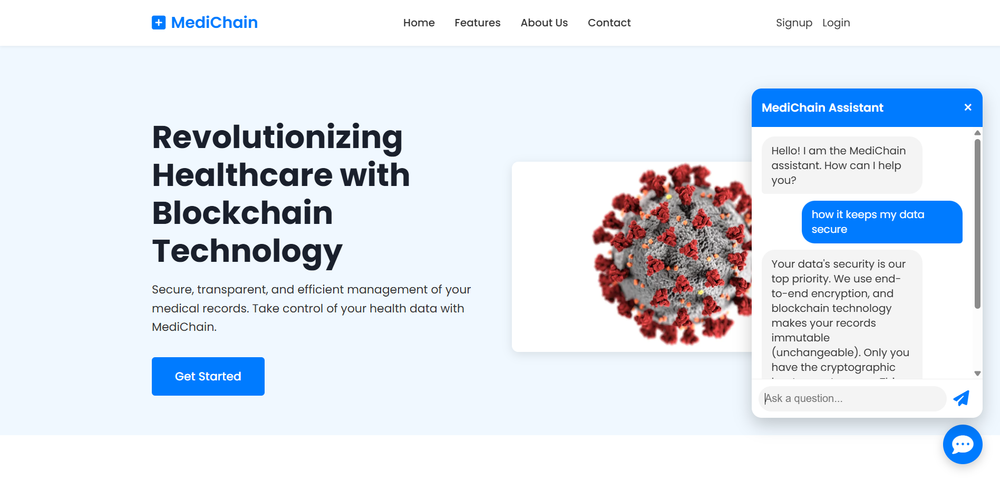
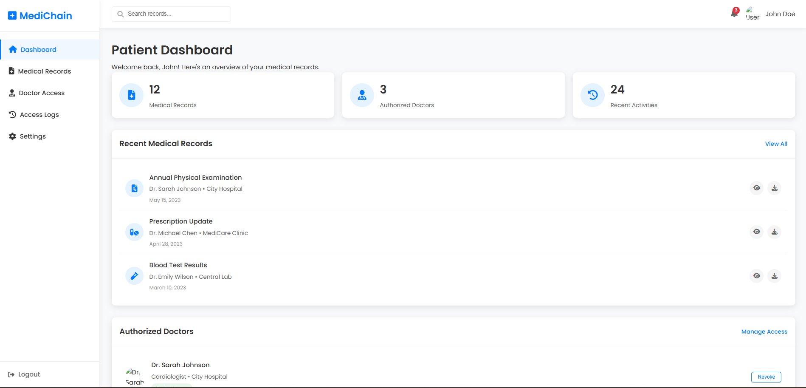
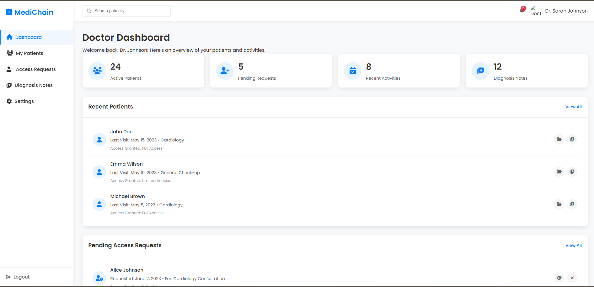

# Medichain-Hackorbit

<p align="center">
  <h1 align="center"><a href="https://medichain.biz/" target="_blank">MediChain</a></h1>
  <p align="center">
    Revolutionizing healthcare data management: blockchain-based medical record storage for patients 
    This repository contains the Solidity smart contract for **MediChain**, a decentralized platform for managing and accessing medical records securely using **zkSync Era**.
  
  </p>
</p>

## ℹ Problem Statement

The data privacy of patients is essential because it involves sensitive personal information, such as medical records, test results, and health history. If failed to do so it can result in various consequences, such as financial loss, identity theft, damage to reputation, and even physical harm. It can also lead to discrimination, as individuals with certain health conditions may face challenges in obtaining health insurance.

## ℹ About The Project

Our project MediChain seeks to address these challenges by leveraging the power of blockchain to create a secure, decentralized platform for storing and sharing healthcare data. By doing so, we hope to empower patients and Insurance providers, to make more informed decisions, improve outcomes, and advance the field of healthcare as a whole.

## ℹ Future Prospects
1. We will be implementing insurance policy as ERC-721 Standard (i.e Non-Fungible Tokens), so as to specify the uniqueness and ownership of each insurance policy.
2. We will be giving patients the flexibility to buy health insurance policy according to their preference instead of defined policies by the insurance provider.
3. We will predict policy annual premium amount using Machine Learning techniques based on factors like patient's age, location, etc.

## 🚀 Features

- 👤 **User Authentication** for Patients and Doctors
- 📁 **Secure Upload** and management of medical records
- 🔗 **Blockchain Integration** to ensure data immutability
- 🛡️ **Access Control**: Patients can grant/revoke record access
- 📊 **Doctor Dashboard** with patient lists, diagnosis notes
- 🤖 **AI Chatbot Assistant** 
- 🌐 **Modern UI** with responsive dashboard layout

---

## 🧱 Tech Stack

| Layer         | Technologies                         |
|--------------|--------------------------------------|
| **Frontend**  | HTML, CSS (TailwindCSS/Dashboard CSS), JavaScript |
| **Backend**   | Python (Flask)                      |
| **Blockchain**| Custom Python Blockchain            |
| **Database**  | SQLite  (for metadata & users)      |
| **Storage**   | Local uploads or IPFS               |
| **AI Bot**    | Rasa                                |

---
---

## 📦 Prerequisites

- python3.8 or less
- Metamask wallet (Goerli testnet funds + zkSync testnet connected)
- Internet access to Remix IDE
- Contract file: `medichain.sol`
- rasa framework
- flask

---

## 📸 Screenshots

<details>
<summary>🖥️ Click to expand</summary>

**🏠 Homepage**


**📋 Patient Dashboard**


**📋 Doctor Dashboard**


**📋 Doctor Access**
)

**📋 Access Requests**


**📋 Medical Records**


**📋 My Patients**


**📋 Diagnosis Notes**


**📋Doctors Settings**


**📋 Patient Settings**


**📋 Blockchain**


 </details>
 ---

## 🛠️ Installation

# Clone the repository
git clone [https://github.com/Vaibhav21C/Medichain-Hackorbit]
cd medichain

# Run the Blockchain file
  ### ✅ 1. Open Remix

Go to: [https://remix.ethereum.org](https://remix.ethereum.org)

---

 ### ✅ 2. Enable zkSync Remix Plugin

1. Click the **"Plugins"** tab on the sidebar.
2. Search for **zkSync** and activate the plugin.
3. A new **zkSync Deploy & Verify** tab will appear.

---

 ### ✅ 3. Add Your Contract

1. In Remix’s **File Explorer**, create or upload your contract:
   - File: `medichain.sol`
2. Make sure your contract uses:
   ```solidity
   // SPDX-License-Identifier: MIT
   pragma solidity ^0.8.18;

   contract MediChain {
       //extract this from medichain.sol
   }


# Create a virtual environment
python -m venv venv
source venv/bin/activate  # or venv\Scripts\activate on Windows

# Run the rasa server
rasa run --enable-api --cors "*"

# Run the Flask server
python app.py

